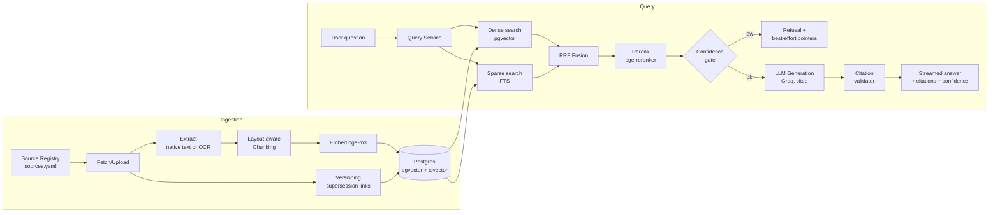

# KANUNI — Regulatory & Compliance Intelligence Engine

> **Master Build Specification & Claude Code Instructions**
> Version 1.0 — This document is the single source of truth for the project. It lives in the repo root as `PROJECT_SPEC.md`. All code generated must conform to it. When a decision is not covered here, follow the Engineering Standards (Section 4) and record the decision as an ADR (Section 15).

---

## 1. Project Overview

**Kanuni** (Swahili: "rule / regulation") is a production-grade Retrieval-Augmented Generation system that lets compliance officers, founders, and operators in East Africa ask natural-language questions about financial, tax, and trade regulations — and receive **cited, versioned, confidence-gated answers** grounded in official documents (Bank of Tanzania circulars, TRA notices, EAC customs instruments, AML directives, etc.).

**What makes this production-grade, not a toy:**

1. Ingestion is a first-class pipeline (OCR, layout-aware chunking, document versioning & supersession modeling), not a script.
2. Retrieval is hybrid (dense + sparse + reranking) with measured, benchmarked quality — not "embeddings and pray."
3. Answers are citation-grounded with a confidence gate: the system **refuses or escalates** rather than hallucinating on low-confidence retrievals.
4. A full evaluation harness runs in CI. Every change to prompts, chunking, or retrieval shows a metrics diff before merge.
5. Real ops: structured logging, tracing, error tracking, cost accounting per request, health checks.
6. The repo is public and built to be read: clean architecture, typed code, documented decisions, one-command local setup.

**Corpus scope (v1):** Bank of Tanzania documents ONLY — acts, regulations, circulars, and guidelines issued by BoT. This is a deliberate depth-over-breadth decision: one issuing body allows complete coverage, a coherent supersession graph, and a high-quality golden dataset. **However, nothing in the codebase may assume BoT:** issuing body, jurisdiction, and source definitions live entirely in `sources.yaml` and database rows. Adding TRA, FIU, or EAC later must require zero engine code changes — this extensibility is verified by an integration test that ingests a fixture from a fictional second source. Record this scoping decision as ADR 0001.

**Non-goals (v1):** other institutions' corpora (TRA, FIU, EAC, BRELA — deferred to v2 as data additions), user accounts with billing, multi-tenant orgs, mobile apps, fine-tuned models, agents. Keep scope tight.

---

## 2. Tech Stack (locked)

| Layer                    | Choice                                                                                                                                       | Notes                                             |
| ------------------------ | -------------------------------------------------------------------------------------------------------------------------------------------- | ------------------------------------------------- |
| API & ingestion services | Python 3.12, FastAPI, Pydantic v2                                                                                                            | Fully typed, async-first                          |
| Database + vector store  | Supabase (PostgreSQL 15 + pgvector)                                                                                                          | Single DB for relational + vectors + full-text    |
| Sparse retrieval         | PostgreSQL full-text search (tsvector, `websearch_to_tsquery`)                                                                               | BM25-style via `ts_rank_cd`; no extra infra       |
| Embeddings               | `BAAI/bge-m3` (multilingual, supports English + Swahili) served locally via `sentence-transformers`, or hosted equivalent                    | Multilingual is a hard requirement                |
| Reranker                 | `BAAI/bge-reranker-v2-m3`                                                                                                                    | Cross-encoder rerank of top-k candidates          |
| Generation LLM           | Groq (`llama-3.3-70b-versatile` primary) with provider abstraction + fallback slot                                                           | Never hardcode a provider in business logic       |
| OCR                      | `pytesseract` + `pdfplumber`/`PyMuPDF` for native text; OCR only when text layer absent                                                      | Detect scanned vs native automatically            |
| Task queue               | Native `asyncio` workers + Postgres-backed job table (v1); design so a queue (e.g. Redis/ARQ) can replace it without touching business logic | Keep infra minimal, swappable                     |
| Frontend                 | Next.js 14+ (App Router), TypeScript, Tailwind, shadcn/ui                                                                                    | Streaming answers, inline citation highlighting   |
| Deployment               | API on Fly.io (Dockerized); frontend on Vercel; DB on Supabase                                                                               |                                                   |
| CI/CD                    | GitHub Actions                                                                                                                               | Lint → typecheck → tests → evals → build → deploy |
| Observability            | OpenTelemetry traces, structlog JSON logs, Sentry for errors                                                                                 |                                                   |
| Package management       | `uv` for Python, `bun` for JS                                                                                                                | Lockfiles committed (see ADR 0001)                |

---

## 3. Repository Structure (monorepo)

```
kanuni/
├── PROJECT_SPEC.md              # this document
├── README.md                    # see §16 for required contents
├── LICENSE                      # MIT
├── CONTRIBUTING.md
├── SECURITY.md                  # vulnerability disclosure policy
├── .env.example                 # every env var documented, no real values
├── docker-compose.yml           # full local stack: db, api, worker, frontend
├── Makefile                     # make setup / dev / test / eval / lint
├── .github/
│   └── workflows/
│       ├── ci.yml               # lint, typecheck, unit+integration tests
│       ├── evals.yml            # eval suite w/ metrics diff comment on PR
│       └── deploy.yml           # staging → smoke test → manual gate → prod
├── docs/
│   ├── architecture.md          # + mermaid diagrams
│   ├── adr/                     # 0001-hybrid-retrieval.md, etc.
│   ├── data-model.md
│   └── runbook.md               # ops: common failures & fixes
├── apps/
│   ├── api/                     # FastAPI service
│   │   ├── src/kanuni_api/
│   │   │   ├── main.py          # app factory, middleware wiring only
│   │   │   ├── config.py        # pydantic-settings, single source of env
│   │   │   ├── routes/          # thin HTTP layer only
│   │   │   ├── services/        # business logic (query, ingestion mgmt)
│   │   │   ├── retrieval/       # dense.py, sparse.py, fusion.py, rerank.py
│   │   │   ├── generation/      # llm_client.py (provider abstraction),
│   │   │   │                    # prompts/ (versioned prompt files),
│   │   │   │                    # citation.py, confidence.py
│   │   │   ├── models/          # pydantic domain models
│   │   │   ├── db/              # repositories (all SQL lives here)
│   │   │   ├── middleware/      # auth, rate limit, request-id, error handler
│   │   │   └── telemetry/       # logging, tracing, metrics setup
│   │   └── tests/               # mirrors src structure
│   ├── ingestion/               # pipeline service/worker
│   │   ├── src/kanuni_ingest/
│   │   │   ├── pipeline.py      # orchestrates stages, resumable
│   │   │   ├── stages/          # fetch.py, extract.py, ocr.py,
│   │   │   │                    # chunk.py, embed.py, index.py
│   │   │   ├── versioning.py    # supersession & amendment logic
│   │   │   └── registry.py      # document registry management
│   │   └── tests/
│   └── web/                     # Next.js frontend
├── packages/
│   └── shared/                  # shared pydantic/TS types (openapi-generated)
├── evals/
│   ├── golden/                  # golden Q&A dataset (JSONL, versioned)
│   ├── run_retrieval_eval.py    # recall@k, MRR, nDCG
│   ├── run_answer_eval.py       # faithfulness, citation precision
│   └── report.py                # markdown metrics report for CI comment
└── infra/
    ├── migrations/              # SQL migrations (sqitch or dbmate style, numbered)
    └── fly.toml
```

**Rules:**

- Routes contain no business logic. Services contain no SQL. All SQL lives in `db/` repositories. All external I/O (LLM, embeddings, storage) behind interfaces so implementations are swappable and mockable.
- No file over ~400 lines. No function over ~50 lines without justification.
- Every module has a docstring stating its responsibility in one sentence.

---

## 4. Engineering Standards (apply to ALL code)

### 4.1 Code quality

- Python: `ruff` (lint + format), `mypy --strict`. TypeScript: `strict: true`, ESLint, Prettier. CI fails on any violation.
- Full type annotations everywhere. Pydantic models at every system boundary (HTTP, DB rows → domain, LLM outputs).
- Google-style docstrings on all public functions/classes: purpose, args, returns, raises.
- Naming: descriptive, no abbreviations (`retrieval_candidates`, not `rc`).
- No dead code, no commented-out code, no TODOs without a linked issue.

### 4.2 Error handling (mandatory patterns)

- Define a domain exception hierarchy in `kanuni_api/exceptions.py`:
  `KanuniError` → `RetrievalError`, `GenerationError`, `IngestionError`, `DocumentNotFoundError`, `LowConfidenceError`, `ProviderRateLimitError`, `ProviderTimeoutError`, `ValidationFailedError`.
- A single global FastAPI exception handler maps domain exceptions → RFC 7807 problem-details JSON responses with stable machine-readable `error_code` fields. **Never** leak stack traces, SQL, or provider payloads to clients.
- Every external call (LLM, embedding, OCR, DB) wrapped with: timeout, bounded retry with exponential backoff + jitter (use `tenacity`), and a circuit-breaker-style fallback where defined (e.g., Groq → fallback provider slot).
- All errors logged with `request_id`, `document_id`/`query_id` context. User-facing messages are helpful but generic; details go to logs/Sentry only.
- Ingestion is **resumable**: each pipeline stage is idempotent, persists its status per document in the job table, and a crashed run resumes from the last completed stage — never reprocesses from scratch, never leaves partial index state (stage writes are transactional).

### 4.3 Security

- **Secrets:** only via environment variables through `pydantic-settings`. `.env` gitignored; `.env.example` documents every var. CI secret-scans with `gitleaks`.
- **API auth (v1):** API-key auth via `X-API-Key` header, keys stored **hashed** (SHA-256) in DB with per-key rate limits and scopes (`query`, `ingest:admin`). Ingestion/admin endpoints require the admin scope.
- **Rate limiting:** token-bucket per API key (middleware), returns 429 with `Retry-After`.
- **Input validation:** strict Pydantic on all inputs; max query length; file-type + size + magic-byte validation on any uploaded PDF; filenames sanitized; uploads stored under generated UUIDs, never user-supplied names.
- **Prompt-injection defense:** retrieved document text is untrusted. It is wrapped in clearly delimited context blocks; the system prompt instructs the model to treat context as data; answers must cite chunk IDs that actually exist (validated server-side — see §8.3). Log and flag suspicious injection-like content in documents.
- **SQL:** parameterized queries only. No string-built SQL anywhere.
- **HTTP:** CORS locked to the frontend origin; standard security headers; HTTPS-only in deployment.
- **Dependencies:** Dependabot enabled; `pip-audit` / `bun audit` in CI.
- **PII:** the system stores regulations (public documents) and queries. Query logs are retained 30 days by default and this is documented.

### 4.4 Reusability / public-repo readiness

- `docker compose up` brings up the entire stack locally with seeded sample documents. `make setup && make dev` must work on a clean machine — this is tested in CI with a fresh-clone job.
- The corpus is pluggable: adding a new document source = adding a YAML entry in `sources.yaml` + optionally a fetcher class. Nothing East-Africa-specific is hardcoded in the engine; jurisdiction lives in config/data.
- Prompts are versioned files in `generation/prompts/` (e.g., `answer_v3.md`), never inline strings. The active version is config.
- OpenAPI spec auto-generated; TS client types generated from it into `packages/shared`.

---

## 5. Architecture



Two deployable services (API, ingestion worker) + frontend. They share the DB and the `shared` package only — no direct service-to-service calls in v1.

---

## 6. Data Model (core tables — full DDL in `infra/migrations/`)

- **documents**: `id (uuid)`, `source_id`, `title`, `doc_type` (circular|act|regulation|notice|guideline), `jurisdiction`, `issuing_body`, `reference_number`, `language`, `issued_date`, `effective_date`, `status` (in_force|superseded|repealed|unknown), `file_sha256` (dedup), `storage_path`, `ingested_at`, `pipeline_status`.
- **document_relations**: `from_document_id`, `to_document_id`, `relation` (supersedes|amends|refers_to). This models "Circular 4/2024 supersedes 9/2022" explicitly.
- **chunks**: `id`, `document_id`, `section_ref` (e.g., "Part III, s.12(2)"), `page_start`, `page_end`, `content`, `content_tsv` (generated tsvector), `embedding vector(1024)`, `token_count`, `chunk_index`. Indexes: HNSW on embedding, GIN on tsvector.
- **ingestion_jobs**: per-document stage statuses (`fetched|extracted|chunked|embedded|indexed|failed`), attempt counts, error details — powers resumability.
- **queries**: `id`, `api_key_id`, `question`, `retrieved_chunk_ids`, `confidence`, `answered` (bool), `latency_ms`, `token_cost`, `created_at` — powers analytics, evals, and the cost dashboard.
- **api_keys**: `id`, `key_hash`, `name`, `scopes[]`, `rate_limit_per_min`, `created_at`, `revoked_at`.

**Versioning rule:** retrieval **excludes** chunks from documents with `status = superseded/repealed` by default; the API exposes `include_historical=true` for point-in-time questions, and answers must state the document status when historical content is used.

---

## 7. Ingestion Pipeline Specification

Stages (each idempotent, individually retryable, status persisted):

1. **Fetch/Upload** — from `sources.yaml` URLs or admin upload endpoint. Compute SHA-256; skip exact duplicates; store original in Supabase Storage.
2. **Extract** — try native text (PyMuPDF). Heuristic: if a page yields < 50 chars of text but has images, mark scanned → OCR that page (Tesseract, `eng+swa`). Record per-page extraction method and OCR confidence.
3. **Structure & chunk** — layout-aware: detect headings/clause numbering (regex + font-size cues from PyMuPDF), keep tables intact (extract with pdfplumber, render as markdown tables inside the chunk). Chunking: split on structural boundaries first, then pack to a target of ~450 tokens with 60-token overlap, **never splitting mid-clause or mid-table**. Every chunk carries `section_ref` + page numbers — citations depend on this.
4. **Metadata & versioning** — extract reference number, dates, issuing body (regex + a single cheap LLM extraction call with a strict Pydantic-validated JSON schema; on validation failure → flag for manual review, do not guess). Detect supersession language ("this circular supersedes…") → create `document_relations` rows and update the old document's status.
5. **Embed & index** — batch-embed chunks; write chunks + embeddings in one transaction per document.

Failure policy: a stage failure marks the job `failed` with structured error; the document is **not** partially searchable. An admin endpoint lists failed jobs with reasons and supports retry.

**Bulk ingestion CLI (`kanuni ingest`):** a typer-based CLI in `apps/ingestion` — `kanuni ingest <folder> --source <source_id> [--manifest sources.yaml]`. It walks the folder for PDFs, validates each (type, size, magic bytes), matches against manifest entries when provided, uploads via the admin API (authenticated with the admin API key from env), and renders a per-file progress/status table (rich). It is a pure API client — it never touches the database or storage directly. Already-ingested files (matching SHA-256) are reported as skipped, making the command safely re-runnable. Exit code non-zero if any file fails.

---

## 8. Query Path Specification

### 8.1 Retrieval

1. Embed the question (same bge-m3 model).
2. **Dense:** top 30 by cosine similarity (HNSW), filtered by `status = in_force` unless historical requested.
3. **Sparse:** top 30 via FTS (`websearch_to_tsquery`, `ts_rank_cd`), same filters.
4. **Fusion:** Reciprocal Rank Fusion (k = 60) → top 20 candidates.
5. **Rerank:** cross-encoder scores question vs. each candidate → keep top 6.

All parameters (30/30/20/6, RRF k, thresholds) live in config, not code, and are covered by the eval suite.

### 8.2 Confidence gate

- If top rerank score < `CONFIDENCE_REFUSE_THRESHOLD` (default 0.30): return a structured refusal — "insufficient grounds in the indexed corpus" — plus the 3 nearest documents as pointers. Never generate an answer.
- If between refuse and `CONFIDENCE_CAUTION_THRESHOLD` (default 0.55): answer, but response carries `confidence: "low"` and the frontend renders a visible caution banner.
- Thresholds are calibrated against the golden dataset (see §10) and the calibration method documented in an ADR.

### 8.3 Generation & citation contract

- Prompt (versioned file) receives: question, the 6 chunks each tagged `[chunk:<id>] (<doc title>, <reference_number>, <section_ref>, status)`.
- The model must answer **only** from provided chunks and cite as `[chunk:<id>]` inline after each claim.
- **Server-side citation validator:** parse citations from the output; every cited ID must be in the provided set; strip/repair invalid ones; if an answer ends up with zero valid citations → convert to refusal. Compute `citation_density` and log it.
- Response is streamed (SSE). Final SSE event carries structured metadata: citations resolved to `{document_title, reference_number, section_ref, pages, status, chunk_id}`, confidence tier, token usage, latency.
- If any cited document is not `in_force`, the answer must explicitly say so (enforced by prompt + a post-check that flags violations to logs).

### 8.4 API surface (v1)

- `POST /v1/query` (scope: query) — `{question, include_historical?, top_k?}` → SSE stream.
- `GET /v1/documents` / `GET /v1/documents/{id}` — registry browsing, filterable.
- `POST /v1/admin/documents` (scope: ingest:admin) — upload/register a document.
- `GET /v1/admin/ingestion-jobs` + `POST .../retry`.
- `GET /healthz` (liveness) and `GET /readyz` (DB + embedding model readiness).

---

## 9. Frontend Specification (Next.js)

Pages: **Ask** (main), **Documents** (registry browser with status/type filters), **About** (what this is, corpus coverage, limitations — honesty is a feature).

Ask page requirements:

- Streaming answer with inline citation chips; hovering/tapping a chip opens a side panel showing the exact chunk text, document metadata, page numbers, and a link to the source PDF page.
- Confidence banner for low-confidence answers; distinct, well-designed refusal state that shows the nearest-document pointers.
- Recent questions (local only), loading/skeleton states, full error states (rate-limited, server error, network) — no dead-end spinners.
- Responsive, accessible (keyboard nav, aria labels, contrast), dark mode. Clean and modern; no clutter.

---

## 10. Evaluation Harness (this is a headline feature)

- `evals/golden/qa.jsonl`: minimum 60 items at launch, each: `{question, relevant_chunk_ids or relevant_doc+section, ideal_answer_points[], must_refuse: bool}`. Include: English + Swahili questions, point-in-time/superseded cases, and at least 10 **out-of-corpus questions that must be refused**.
- **Retrieval metrics:** recall@5, recall@20, MRR, nDCG@10 — computed for dense-only, sparse-only, hybrid, hybrid+rerank (the comparison table proves the architecture).
- **Answer metrics:** faithfulness (LLM-as-judge with a strict rubric prompt, judge model ≠ answer model), citation precision/recall, refusal accuracy (both false-answer rate on must-refuse items and false-refusal rate on answerable items).
- `make eval` runs everything locally and writes `evals/reports/<date>.md`. In CI (`evals.yml`), evals run on every PR touching `retrieval/`, `generation/`, `prompts/`, chunking, or eval code, and a bot comment posts the **metrics diff vs. main**. A configurable regression threshold (e.g., recall@5 drop > 3 points) fails the check.

---

## 11. Observability & Ops

- **Logging:** structlog, JSON, every log line carries `request_id` (middleware-generated, returned in response headers).
- **Tracing:** OpenTelemetry spans for the full query path: embed → dense → sparse → fuse → rerank → generate → validate; ingestion stages likewise. Export OTLP (compatible with Grafana Tempo/Honeycomb; local dev prints spans).
- **Errors:** Sentry SDK in API, worker, and frontend, with release tagging from git SHA.
- **Cost accounting:** every query row records prompt/completion tokens and computed cost; `GET /v1/admin/stats` returns daily cost, query counts, refusal rate, p50/p95 latency.
- **Runbook (`docs/runbook.md`):** at minimum — provider outage/fallback behavior, ingestion job stuck/failed, DB migration rollback, rotating API keys, re-indexing after embedding model change.

---

## 12. CI/CD Pipelines

**`ci.yml`** (every push/PR): ruff + mypy + eslint/tsc → unit tests → integration tests (spin up Postgres+pgvector service container, run migrations, test retrieval SQL against seeded fixtures) → gitleaks + pip-audit → fresh-clone `make setup` smoke job → Docker build.
**`evals.yml`**: as in §10, path-filtered, posts metrics-diff PR comment.
**`deploy.yml`** (merge to main): build & push image → deploy to Fly.io **staging** → run smoke tests against staging (`/readyz`, one canned query asserting a citation is returned) → **manual approval gate** → deploy prod → Sentry release + tag.
Migrations run automatically pre-deploy; every migration must have a tested down/rollback path.

---

## 13. Testing Requirements

- Unit tests: chunking (clause boundaries, tables, overlap), versioning/supersession logic, RRF fusion math, citation parser/validator, confidence gate, error mapping to problem-details.
- Integration tests: full ingestion of 2–3 fixture PDFs (one native, one scanned, one with tables) through to searchable chunks; full query path with a **mocked LLM** (deterministic fixture responses) asserting citations, streaming format, refusal behavior.
- Coverage target: ≥ 80% on `retrieval/`, `generation/`, `ingestion/stages/`, `versioning`. Coverage reported in CI.
- No test may call a real LLM/embedding API — all external providers mocked via their interfaces. Evals are the only place real models run.

---

## 14. Build Phases (execute in order; each phase ends with green CI)

**Phase 0 — Skeleton & spine.** Monorepo scaffold per §3, tooling (ruff/mypy/eslint), docker-compose with Postgres+pgvector, migrations framework + initial schema (§6), config module, logging/tracing/error-handler middleware, healthchecks, `ci.yml`. Deliverable: `make dev` runs an empty-but-healthy stack; CI green.

**Phase 1 — Ingestion pipeline.** Stages 1–5 (§7), job table + resumability, admin upload endpoint + API-key auth middleware, fixture PDFs + integration tests. Deliverable: fixture corpus ingested and inspectable via `GET /v1/documents`.

**Phase 2 — Retrieval.** Dense, sparse, RRF, reranker, config-driven params, retrieval-only debug endpoint (`/v1/admin/retrieve` returning scored chunks). Deliverable: retrieval eval script runs with the 4-way comparison table on the fixture golden set.

**Phase 3 — Generation & citations.** LLM provider abstraction + Groq impl + fallback slot, versioned prompts, SSE streaming, citation validator, confidence gate, query logging with cost. Deliverable: full `POST /v1/query` path with mocked-LLM tests + manual real run.

**Phase 4 — Evaluation harness.** Golden dataset to 60+ items, both eval scripts, report generator, `evals.yml` with PR metrics diff. Deliverable: baseline metrics committed to `docs/` and referenced in README.

**Phase 5 — Frontend.** §9 in full against the live API. Deliverable: deployed on Vercel against staging API.

**Phase 6 — Ship & harden.** `deploy.yml`, Fly.io staging+prod, Sentry wiring, rate limiting verified under load (simple k6 script), runbook, README finalized, architecture doc + ADRs complete, demo GIF/video recorded. Deliverable: public launch.

---

## 15. ADRs (write these as decisions are implemented)

Required at minimum: hybrid retrieval + RRF choice; bge-m3 embedding choice (multilingual rationale + benchmark); confidence-threshold calibration method; Postgres-backed jobs vs. dedicated queue; chunking strategy; API-key auth (v1) vs. OAuth (deferred). Template: Context / Decision / Alternatives considered / Consequences.

## 16. README (required sections)

One-paragraph pitch + demo GIF → live demo link → architecture diagram → key features (with the eval results table — real numbers) → quickstart (`docker compose up`, < 10 lines) → adding your own corpus (`sources.yaml` guide) → API examples (curl) → evaluation methodology summary → limitations & responsible-use note ("not legal advice") → license & contributing.

## 17. Definition of Done (project-level)

- [ ] Live public demo (frontend + API) with ≥ 100 real documents indexed
- [ ] CI: lint, types, tests (≥80% on core), security scans — all green
- [ ] Eval report in repo showing hybrid+rerank beating dense-only, with refusal accuracy measured
- [ ] Zero secrets in repo history (gitleaks clean)
- [ ] Fresh-clone setup verified in CI
- [ ] Runbook, architecture doc, ≥ 6 ADRs
- [ ] p95 query latency < 6 s streamed-first-token < 2 s (documented)
- [ ] README meets §16; demo video recorded
